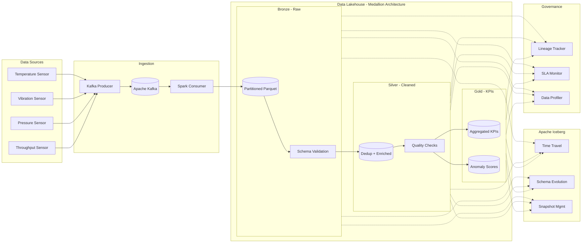

# Watsonx Data Lakehouse Pipeline

[](https://www.python.org/)
[](https://www.ibm.com/products/watsonx-data)
[](https://spark.apache.org/)
[](https://iceberg.apache.org/)
[](https://kafka.apache.org/)
[](LICENSE)
[](https://github.com/galafis/watsonx-data-lakehouse-pipeline/actions/workflows/ci.yml)

**Real-Time IoT Data Lakehouse** with IBM Watsonx Data, Spark Structured Streaming, Apache Iceberg, and Medallion Architecture.

---

## Idiomas | Languages

- [Portugues (BR)](#portuguese)
- [English (US)](#english)

---

<a name="portuguese"></a>

## Portugues

### Visao Geral

Pipeline de Data Lakehouse em tempo real para ingestao, processamento e analise de dados de sensores IoT industriais. Implementa a **Medallion Architecture** (Bronze, Silver, Gold) com Apache Iceberg para time-travel e schema evolution, Spark Structured Streaming para processamento em tempo real, e Apache Kafka como barramento de eventos.

### Funcionalidades

| Funcionalidade | Descricao |
|---|---|
| **Ingestao em Tempo Real** | Spark Structured Streaming consome eventos IoT do Kafka com parsing de schema |
| **Medallion Architecture** | Camadas Bronze (raw), Silver (limpa/enriquecida), Gold (KPIs agregados) |
| **Apache Iceberg** | Tabelas com time-travel, schema evolution, snapshot management e compactacao |
| **Qualidade de Dados** | Suite de expectativas (schema, nulls, ranges, estatisticas) com Great Expectations |
| **Profiling Automatizado** | Profiling de colunas com estatisticas descritivas e deteccao de padroes |
| **Rastreamento de Linhagem** | Grafo de linhagem de dados rastreando transformacoes entre camadas |
| **Monitoramento de SLA** | Verificacao de freshness e completeness com alertas configuraveiss |
| **Simulador IoT** | Gerador de dados sinteticos para sensores de temperatura, vibracao, pressao e throughput |
| **Infraestrutura Docker** | Stack completa com Kafka, MinIO (S3), Spark Master/Worker via Docker Compose |

### Arquitetura


### Medallion Architecture

A **Medallion Architecture** organiza os dados em tres camadas progressivas de qualidade:

| Camada | Objetivo | Transformacoes |
|---|---|---|
| **Bronze** | Landing zone de dados brutos | Ingestao do Kafka, metadados de pipeline, particionamento por data/sensor |
| **Silver** | Dados limpos e enriquecidos | Deduplicacao, limpeza de nulls, z-score, features temporais, rolling stats |
| **Gold** | KPIs e metricas de negocio | Agregacao por janela temporal, anomaly scoring, severity levels |

### Stack Tecnologico

| Componente | Tecnologia |
|---|---|
| Processamento | Apache Spark 3.5 (Structured Streaming) |
| Formato de Tabela | Apache Iceberg 1.5 |
| Message Broker | Apache Kafka (Confluent 7.6) |
| Object Storage | MinIO (compativel S3) |
| AI/ML Platform | IBM Watsonx Data |
| Qualidade | Great Expectations |
| API | FastAPI + Uvicorn |
| Dashboard | Streamlit |
| Linguagem | Python 3.10+ |
| Infra | Docker Compose |

### Quick Start

```bash
# Clonar repositorio
git clone https://github.com/galafis/watsonx-data-lakehouse-pipeline.git
cd watsonx-data-lakehouse-pipeline

# Configurar variaveis de ambiente
cp .env.example .env
# Editar .env com suas credenciais IBM Watsonx

# Iniciar toda a infraestrutura com Docker
docker-compose up -d

# Ou instalar localmente para desenvolvimento
make install-dev

# Executar testes
make test

# Iniciar producer IoT
make run-producer

# Iniciar consumer Spark
make run-consumer
```

### Estrutura do Projeto

```
watsonx-data-lakehouse-pipeline/
├── src/
│   ├── config.py                  # Configuracao centralizada (Pydantic Settings)
│   ├── ingestion/
│   │   ├── kafka_producer.py      # Producer Kafka para dados IoT
│   │   ├── spark_consumer.py      # Consumer Spark Structured Streaming
│   │   └── schema_registry.py     # Schemas PySpark e validacao Pydantic
│   ├── lakehouse/
│   │   ├── bronze.py              # Camada Bronze (raw data)
│   │   ├── silver.py              # Camada Silver (cleaned + enriched)
│   │   ├── gold.py                # Camada Gold (KPIs + anomaly scores)
│   │   └── iceberg_utils.py       # Utilitarios Iceberg (time-travel, schema evolution)
│   ├── quality/
│   │   ├── expectations.py        # Suite de qualidade de dados
│   │   └── profiler.py            # Profiling automatizado
│   └── governance/
│       ├── lineage.py             # Rastreamento de linhagem de dados
│       └── sla_monitor.py         # Monitoramento de SLA
├── tests/                         # Testes unitarios com mocks
├── notebooks/                     # Notebooks demonstrativos
├── docs/                          # Documentacao de arquitetura
├── config/
│   └── settings.yaml              # Configuracoes do pipeline
├── .github/workflows/ci.yml       # CI/CD com GitHub Actions
├── Dockerfile                     # Multi-stage Docker build
├── docker-compose.yml             # Stack completa de servicos
├── Makefile                       # Comandos de automacao
├── pyproject.toml                 # Configuracao do projeto Python
├── requirements.txt               # Dependencias de producao
├── requirements-dev.txt           # Dependencias de desenvolvimento
├── .env.example                   # Template de variaveis de ambiente
└── LICENSE                        # Licenca MIT
```

---

<a name="english"></a>

## English

### Overview

Real-time Data Lakehouse pipeline for ingestion, processing, and analysis of industrial IoT sensor data. Implements the **Medallion Architecture** (Bronze, Silver, Gold) with Apache Iceberg for time-travel and schema evolution, Spark Structured Streaming for real-time processing, and Apache Kafka as the event bus.

### Features

| Feature | Description |
|---|---|
| **Real-Time Ingestion** | Spark Structured Streaming consumes IoT events from Kafka with schema parsing |
| **Medallion Architecture** | Bronze (raw), Silver (cleaned/enriched), Gold (aggregated KPIs) layers |
| **Apache Iceberg** | Tables with time-travel, schema evolution, snapshot management, and compaction |
| **Data Quality** | Expectation suite (schema, nulls, ranges, statistics) with Great Expectations |
| **Automated Profiling** | Column profiling with descriptive statistics and pattern detection |
| **Lineage Tracking** | Data lineage graph tracking transformations across layers |
| **SLA Monitoring** | Freshness and completeness checks with configurable alerts |
| **IoT Simulator** | Synthetic data generator for temperature, vibration, pressure, and throughput sensors |
| **Docker Infrastructure** | Full stack with Kafka, MinIO (S3), Spark Master/Worker via Docker Compose |

### Architecture



### Medallion Architecture

The **Medallion Architecture** organizes data into three progressive quality layers:

| Layer | Purpose | Transformations |
|---|---|---|
| **Bronze** | Raw data landing zone | Kafka ingestion, pipeline metadata, date/sensor partitioning |
| **Silver** | Cleaned and enriched data | Deduplication, null cleaning, z-score, temporal features, rolling stats |
| **Gold** | Business KPIs and metrics | Time-window aggregation, anomaly scoring, severity levels |

### Tech Stack

| Component | Technology |
|---|---|
| Processing | Apache Spark 3.5 (Structured Streaming) |
| Table Format | Apache Iceberg 1.5 |
| Message Broker | Apache Kafka (Confluent 7.6) |
| Object Storage | MinIO (S3-compatible) |
| AI/ML Platform | IBM Watsonx Data |
| Quality | Great Expectations |
| API | FastAPI + Uvicorn |
| Dashboard | Streamlit |
| Language | Python 3.10+ |
| Infrastructure | Docker Compose |

### Quick Start

```bash
# Clone repository
git clone https://github.com/galafis/watsonx-data-lakehouse-pipeline.git
cd watsonx-data-lakehouse-pipeline

# Configure environment variables
cp .env.example .env
# Edit .env with your IBM Watsonx credentials

# Start full infrastructure with Docker
docker-compose up -d

# Or install locally for development
make install-dev

# Run tests
make test

# Start IoT producer
make run-producer

# Start Spark consumer
make run-consumer
```

### Project Structure

```
watsonx-data-lakehouse-pipeline/
├── src/
│   ├── config.py                  # Centralized configuration (Pydantic Settings)
│   ├── ingestion/
│   │   ├── kafka_producer.py      # Kafka producer for IoT data
│   │   ├── spark_consumer.py      # Spark Structured Streaming consumer
│   │   └── schema_registry.py     # PySpark schemas and Pydantic validation
│   ├── lakehouse/
│   │   ├── bronze.py              # Bronze layer (raw data)
│   │   ├── silver.py              # Silver layer (cleaned + enriched)
│   │   ├── gold.py                # Gold layer (KPIs + anomaly scores)
│   │   └── iceberg_utils.py       # Iceberg utilities (time-travel, schema evolution)
│   ├── quality/
│   │   ├── expectations.py        # Data quality expectation suite
│   │   └── profiler.py            # Automated data profiling
│   └── governance/
│       ├── lineage.py             # Data lineage tracking
│       └── sla_monitor.py         # SLA monitoring
├── tests/                         # Unit tests with mocks
├── notebooks/                     # Demo notebooks
├── docs/                          # Architecture documentation
├── config/
│   └── settings.yaml              # Pipeline configuration
├── .github/workflows/ci.yml       # CI/CD with GitHub Actions
├── Dockerfile                     # Multi-stage Docker build
├── docker-compose.yml             # Full service stack
├── Makefile                       # Automation commands
├── pyproject.toml                 # Python project configuration
├── requirements.txt               # Production dependencies
├── requirements-dev.txt           # Development dependencies
├── .env.example                   # Environment variables template
└── LICENSE                        # MIT License
```

---

## Autor | Author

**Gabriel Demetrios Lafis**

- GitHub: [galafis](https://github.com/galafis)
- LinkedIn: [gabriel-demetrios-lafis](https://www.linkedin.com/in/gabriel-demetrios-lafis)

## Licenca | License

This project is licensed under the MIT License - see the [LICENSE](LICENSE) file for details.
