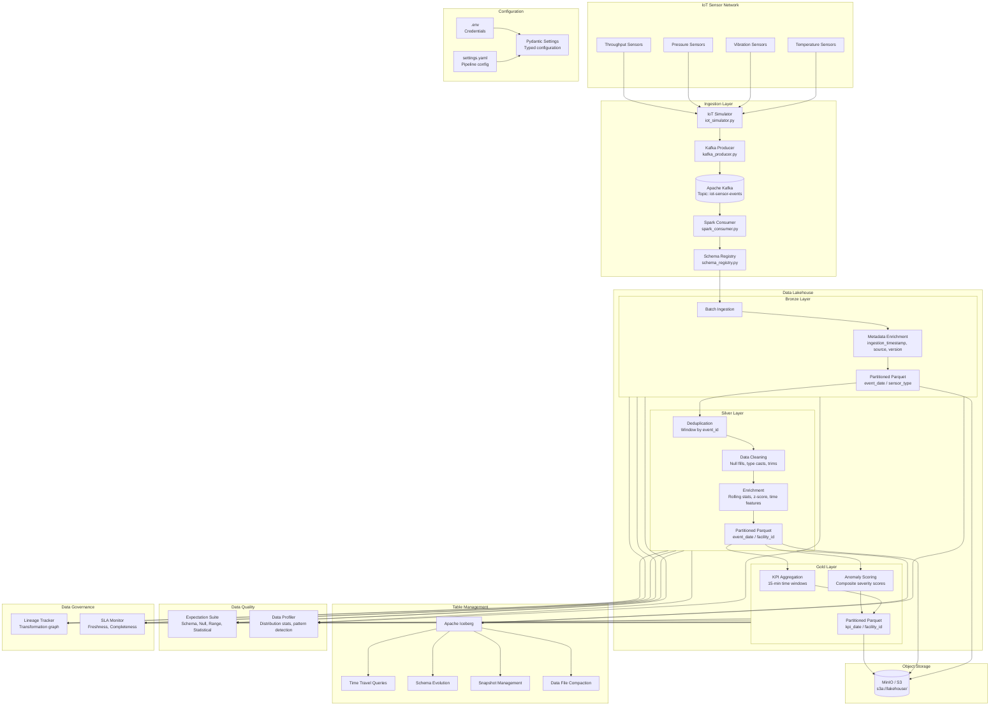

# Architecture Documentation

## System Overview

The Watsonx Data Lakehouse Pipeline is a real-time IoT data platform that ingests, processes, and analyzes industrial sensor data using the Medallion Architecture pattern. The system combines Apache Kafka for event streaming, Apache Spark for distributed processing, Apache Iceberg for table management, and IBM Watsonx Data as the AI/ML platform.

## High-Level Architecture



## Component Details

### 1. Ingestion Layer

#### Kafka Producer (`src/ingestion/kafka_producer.py`)

The `SensorDataProducer` class sends IoT events to Kafka with:
- Gzip compression for bandwidth efficiency
- Key-based partitioning by `sensor_id` for ordered processing
- Configurable batch size and continuous production modes
- Acknowledgment mode `acks=all` for delivery guarantees

#### Spark Consumer (`src/ingestion/spark_consumer.py`)

The Spark Structured Streaming consumer:
- Reads from Kafka topic `iot-sensor-events` with earliest offset
- Parses JSON payloads using PySpark StructType schema
- Adds Kafka metadata (timestamp, partition, offset) and ingestion timestamp
- Validates required fields and sensor types before writing
- Writes to Bronze layer with 30-second micro-batch trigger

#### Schema Registry (`src/ingestion/schema_registry.py`)

Dual-schema approach:
- **Pydantic `IoTEvent` model**: Runtime validation with type checking, range constraints on `quality_score` (0.0-1.0), and optional metadata
- **PySpark `StructType` schema**: Streaming parse schema with 10 fields including `MapType` for metadata

### 2. Medallion Architecture

#### Bronze Layer (`src/lakehouse/bronze.py`)

**Purpose**: Raw data landing zone preserving original data for auditability.

| Operation | Description |
|---|---|
| `ingest_batch()` | Adds `ingestion_timestamp`, `event_date`, `source`, `pipeline_version` columns |
| Partitioning | By `event_date` and `sensor_type` for efficient querying |
| Format | Parquet with append mode |
| Retention | Configurable (default: 90 days) |

#### Silver Layer (`src/lakehouse/silver.py`)

**Purpose**: Cleaned, deduplicated, and enriched data for analytics.

| Operation | Description |
|---|---|
| `deduplicate()` | Window function on `event_id` ordered by `ingestion_timestamp`, keeps first occurrence |
| `clean()` | Fills null `quality_score` (default 1.0), `is_anomaly` (default False), casts `value` to double, trims strings, filters invalid sensor types |
| `enrich()` | Computes rolling mean/stddev (100-row window per sensor), z-score, `hour_of_day`, `day_of_week`, `is_business_hours` |
| Partitioning | By `event_date` and `facility_id` |

#### Gold Layer (`src/lakehouse/gold.py`)

**Purpose**: Business KPIs and anomaly scores for dashboards.

**KPI Aggregation** (`aggregate_kpis()`):
- Groups by `facility_id`, `sensor_type`, and configurable time window (default: 15 minutes)
- Computes: `event_count`, `avg_value`, `min_value`, `max_value`, `stddev_value`, `anomaly_count`, `anomaly_rate`, `avg_quality_score`, `avg_z_score`, `max_abs_z_score`

**Anomaly Scoring** (`compute_anomaly_scores()`):
- Composite score per facility per day
- Formula: `severity = avg_abs_z_score * 0.4 + anomaly_rate * 100 * 0.4 + (1 - avg_quality) * 100 * 0.2`
- Severity levels: NORMAL (<=10), ELEVATED (10-25), WARNING (25-50), CRITICAL (>50)

### 3. Apache Iceberg Integration

The `IcebergManager` (`src/lakehouse/iceberg_utils.py`) provides:

| Feature | Method | Description |
|---|---|---|
| Table Creation | `create_table()` | Creates Iceberg tables from DataFrame schemas with partitioning and properties |
| Time Travel | `time_travel()` | Queries tables at specific snapshot IDs or timestamps |
| Snapshot Management | `list_snapshots()` | Lists all snapshots with metadata |
| History | `get_table_history()` | Returns full change history |
| Schema Evolution | `evolve_schema()` | Adds or renames columns without rewriting data |
| Maintenance | `expire_snapshots()` | Removes old snapshots to reclaim storage |
| Compaction | `compact_data_files()` | Rewrites small files into larger ones |

### 4. Data Quality

#### Expectation Suite (`src/quality/expectations.py`)

The `IoTDataQualitySuite` runs four categories of checks:

1. **Schema Checks**: Validates all required columns exist (`event_id`, `sensor_id`, `sensor_type`, `facility_id`, `timestamp`, `value`, `unit`)
2. **Null Checks**: Per-sensor-type null rate validation against configurable thresholds
3. **Range Checks**: Validates sensor values fall within expected ranges (95% in-range threshold)
4. **Statistical Checks**: Coefficient of variation validation (must be < 100%)

#### Data Profiler (`src/quality/profiler.py`)

The `DataProfiler` generates per-column statistics:
- Null count and rate
- Distinct count (cardinality)
- For numeric columns: min, max, mean, stddev, p25, median, p75
- Report generation with recommendations for high-null and low-cardinality columns

### 5. Data Governance

#### Lineage Tracker (`src/governance/lineage.py`)

Records the full data flow through:
- `TransformationStep`: Individual transformation with source/target layers, operation type, row counts, and metadata
- `LineageGraph`: Complete pipeline execution with ordered steps and timestamps
- `LineageTracker`: Manages active and historical lineage graphs

#### SLA Monitor (`src/governance/sla_monitor.py`)

Monitors two key SLAs:

| SLA | Method | Thresholds |
|---|---|---|
| Data Freshness | `check_freshness()` | COMPLIANT (<=30min), WARNING (30-45min), VIOLATED (>45min) |
| Data Completeness | `check_completeness()` | COMPLIANT (>=95%), WARNING (85.5-95%), VIOLATED (<85.5%) |

Alerts are dispatched to configured channels (log, API).

## Infrastructure

### Docker Compose Services

| Service | Image | Port | Purpose |
|---|---|---|---|
| Zookeeper | confluentinc/cp-zookeeper:7.6.0 | 2181 | Kafka coordination |
| Kafka | confluentinc/cp-kafka:7.6.0 | 9092 | Event streaming |
| MinIO | minio/minio:latest | 9000, 9001 | S3-compatible object storage |
| Spark Master | bitnami/spark:3.5 | 7077, 8088 | Spark cluster manager |
| Spark Worker | bitnami/spark:3.5 | - | Spark executor |
| API | Custom (FastAPI) | 8080 | REST API |
| UI | Custom (Streamlit) | 8501 | Dashboard |

### Configuration

The system uses a layered configuration approach:

1. **Environment Variables** (`.env`): Credentials and connection strings
2. **YAML Configuration** (`config/settings.yaml`): Pipeline parameters, quality thresholds, SLA settings
3. **Pydantic Settings** (`src/config.py`): Typed access with validation and defaults

### Data Flow Summary

```
IoT Sensors
    |
    v
Kafka (iot-sensor-events)
    |
    v
Spark Structured Streaming (30s micro-batches)
    |
    v
Bronze Layer (s3a://lakehouse/bronze/)
  - Raw events + ingestion metadata
  - Partitioned: event_date / sensor_type
    |
    v
Silver Layer (s3a://lakehouse/silver/)
  - Deduplicated (window by event_id)
  - Cleaned (nulls, types, trims)
  - Enriched (rolling stats, z-score, time features)
  - Partitioned: event_date / facility_id
    |
    v
Gold Layer (s3a://lakehouse/gold/)
  - KPIs: 15-min window aggregations per facility/sensor
  - Anomaly Scores: daily composite severity per facility
  - Partitioned: kpi_date / facility_id
```

## Technology Decisions

| Decision | Choice | Rationale |
|---|---|---|
| Table format | Apache Iceberg | Time-travel, schema evolution, ACID transactions, partition evolution |
| Streaming | Spark Structured Streaming | Micro-batch processing, exactly-once semantics, DataFrame API |
| Message broker | Apache Kafka | High throughput, durability, replay capability |
| Object storage | MinIO (S3-compatible) | Local development parity with cloud S3 |
| Quality framework | Custom (inspired by Great Expectations) | Lightweight, PySpark-native, configurable |
| Configuration | Pydantic Settings + YAML | Type safety, environment variable integration, hierarchical config |
| Serialization | JSON over Kafka, Parquet at rest | Human-readable transport, columnar analytics storage |
